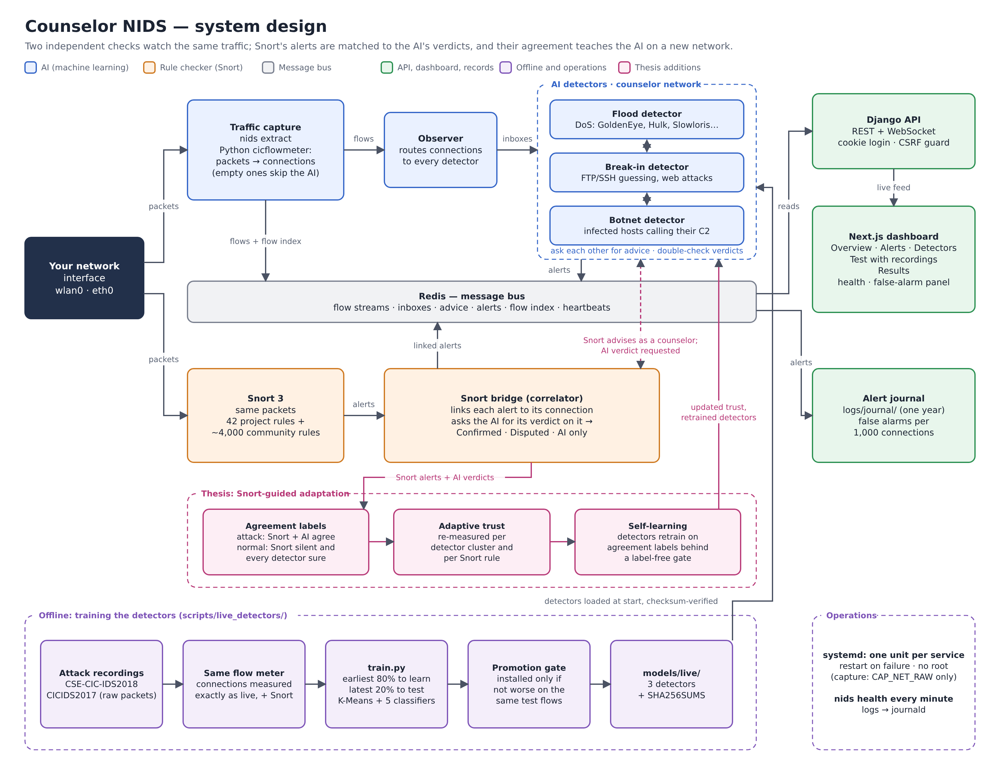

# Counselor NIDS

A network intrusion detection system for live traffic. Two independent checks watch the same
traffic:

- **AI detectors.** Three specialist machine-learning detectors, each trained on a different
  family of attacks. When one is unsure, it asks the others for advice (the counselor
  architecture of Quincozes et al., IFIP 2019).
- **Snort 3.** Signature rules that look inside the traffic for known attack patterns.

Every Snort alert is linked to the connection it belongs to and checked against the AI's
verdict. A web dashboard shows what was caught, who is attacking and how much to trust each
alert.

## Quick start

```bash
./start.sh setup              # once: Python env, packages, database, login user, Snort rules
./start.sh live wlan0         # watch a network interface (asks for sudo once), plus the dashboard
./start.sh                    # dashboard only, on http://localhost:3000 (test with recordings)
./start.sh --prod live wlan0  # the same with production servers (Daphne, optimised build, DEBUG off)
```

You need Python 3.11+, Node, Redis (started for you if it's installed) and Snort 3 for the
rule checker. Ctrl+C stops everything, and logs are in `logs/`. `start.sh` runs on **Linux and
macOS** (on macOS: `brew install snort redis node`); on **Windows**, use Docker or WSL2 for the
dashboard and tests — live capture of the machine's own Wi-Fi needs a Linux or macOS host.

**On any OS (Linux, macOS, Windows), or to avoid installing those yourself**, run it in
containers instead — one command, with Snort included:

```bash
docker compose up --build     # dashboard on http://localhost:3000 (login admin / admin)
```

The first build compiles Snort and takes 10-20 minutes; see [Dashboard](#dashboard) below.
Live capture of a real network card still needs a Linux host (`./start.sh live <interface>`).

- To run it permanently, as services that start at boot and restart on failure, see
  [docs/deployment.md](docs/deployment.md).
- To check how it behaves on your own network, see [docs/live-testing.md](docs/live-testing.md).
- Full documentation: [docs/Counselor-NIDS-Documentation.pdf](docs/Counselor-NIDS-Documentation.pdf); how every part
  is built and works, step by step in plain words: [docs/Counselor-NIDS-How-It-Is-Built.pdf](docs/Counselor-NIDS-How-It-Is-Built.pdf).

## How it works



What happens to each connection, step by step: [docs/logic-flow.png](docs/logic-flow.png).

```
                ┌─> flow meter ─> Observer ─> AI detectors ──┐
network (wlan0) ┤                                            ├─> correlator ─> Redis ─> API ─> dashboard
                └─> Snort 3 (snort/nids.lua, rules) ─────────┘          └─> alert journal (logs/journal/)
```

| Service | Role |
|---|---|
| `nids extract --live IFACE` | captures traffic; the Python cicflowmeter turns packets into connection flows |
| `nids observe` | routes each batch of flows to the detectors |
| `nids detect MODEL` | one AI detector: classifies flows, asks the others for advice, answers their requests |
| `nids snort --interface IFACE` | runs Snort on the same traffic, links each alert to its flow and the AI's verdict, and makes Snort's advice available to unsure detectors |
| `nids journal` | keeps every alert on disk, to measure false alarms over days |
| `nids health` | lists the services that are alive (exit 1 if any is down) |

**The detectors.** Each detector clusters traffic (K-Means), then for every cluster picks the
most accurate of five classifiers (naive Bayes, decision trees, random forest). If its
classifiers disagree on a connection, it asks the other detectors (its counselors) and takes
confident advice. With cross-check on, a "normal" verdict is also checked with the others, so
an attack one specialist never learned is still caught by the specialist that did.

| Detector | Model | Knows |
|---|---|---|
| Flood detector | `models/live/live_dos.joblib` | DoS: GoldenEye, Slowloris, Hulk, SlowHTTPTest |
| Break-in detector | `models/live/live_access.joblib` | FTP/SSH password guessing, website attacks |
| Botnet detector | `models/live/live_bot.joblib` | infected hosts calling their command-and-control server |

**Snort and the AI together.** Each Snort alert is linked to its connection (both addresses
and ports, the protocol and the time). A port-scan alert is linked to every connection between
the two hosts within ±30 s. The AI then gives its verdict on that connection:

| Agreement | Meaning |
|---|---|
| **Confirmed** | Snort and the AI both say attack |
| **Disputed** | Snort says attack, the AI says normal: a possible Snort false alarm, or an attack the AI never learned |
| **AI only** | the AI flagged a connection Snort had no alert for |

## Detection results

On `real-attacks-2018.pcap`, the whole system runs on real attack traffic it never trained
on. The recording holds the late minutes of every CSE-CIC-IDS2018 attack, and the test covers
the flow meter, the AI detectors, Snort with the project's rules, and alert linking.
Reproduce it with `python scripts/live_detectors/evaluate_capture.py --no-community`.

| Traffic | Flows | AI | Snort | Either |
|---|---|---|---|---|
| DoS GoldenEye | 1,822 | 99.1% | 4.9% | 99.1% |
| DoS Hulk | 2,861 | 99.9% | 48.2% | 99.9% |
| DoS SlowHTTPTest | 4,450 | 100.0% | 99.8% | 100.0% |
| DoS Slowloris | 760 | 34.7% | 0.0% | 34.7% |
| FTP brute force | 5,040 | 100.0% | 99.8% | 100.0% |
| SSH brute force | 359 | 98.3% | 88.9% | 98.9% |
| Web attacks | 4 | 4 of 4 | 4 of 4 | 4 of 4 |
| Botnet | 540 | 99.6% | 0.0% | 99.6% |
| **Normal (false alarms)** | 1,570 | **0.0%** | **0.3%** | **0.3%** |

On the test split, the latest 20% of every attack, the detectors catch **99.1%** of attack
flows, with false alarms on **2 of 5,192** normal flows (0.04%).

- **The two checks cover each other.** The AI catches the floods and the botnet that Snort's
  rules miss. Snort covers website attacks with its payload rules.
- **Slowloris is the weak spot,** and how much of it is caught depends on the attack's phase:
  85% of test flows across the attack, 60% of the complete last five minutes, and 35% of the
  last three, when the attack winds down (above). With the community rules on, Snort's
  Challenge-ACK rule lifts the last three minutes to 69.5% "either". Retraining on correctly
  measured connections (see [Retraining](#retraining-the-detectors)) raised it from 56% to 85%
  on the test split, and from 50% to 60% on the last five minutes.
- **Website attacks are Snort's job.** The AI has only ~150 website-attack training flows,
  too few to rely on, so the project's rules lead:
  - SQL injection: UNION SELECT; a quote followed by an AND/OR comparison; ORDER BY column
    probing; `information_schema`;
  - cross-site scripting: `<script`, event handlers, `javascript:`, in the URL or a form;
  - website login brute force: 20 password posts from one source in 60 s.

  On the whole 2018 website-attack capture they alert on **188 of the attacker's 207
  connections (90.8%)**, and on nothing else.
- **A botnet host it never saw.** On a third infected host whose traffic was never used for
  training (`cross_host.py`), the system catches **99.8%** of its 15,238 botnet flows, with
  false alarms on **2 of its 4,307** normal flows.

**Keeping false alarms down on live traffic:**

- **Connection-only flows don't go to the AI.** Port scans, failed connections and bare SYN
  floods carry no data. The detectors never trained on such flows and only guess on them (one
  scan produced ~50,000 false alarms), so they're left to Snort's scan detection.
- **Unresolved disagreements count as normal.** When a detector's classifiers disagree and no
  counselor can advise, its "attack" fallback is a blind guess, so `--suppress-fallback` drops
  it.
- **Measure it on your network.** The Overview's false-alarm panel reports alarms per 1,000
  connections from the alert journal. Mark your own attack tests there, so they aren't counted.

**Limits.** The detectors learned from one lab, with one attacker per attack type, and the
botnet detector knows one botnet family (Ares). They don't cover DDoS or infiltration yet.
Port scans and payload exploits are Snort's job.

## Teaching the AI from your verdicts

On a real network, lab-trained detectors misjudge some ordinary traffic. On a home network,
the Flood detector flagged long-lived HTTPS and push connections (ports 443, 5228), whose tiny
keep-alive packets look like slow DoS. Snort's agreement can't fix what Snort can't see, so
the person watching closes the loop:

1. **Mark an alarm.** Open it on the Alerts page and choose **Not an attack** or **Real
   attack**. The verdict is saved with the connection's measurements in `logs/feedback.jsonl`
   (detectors keep the measurements of flagged connections for 7 days). It takes the alarm out
   of the counts at once, and counts for or against any Snort rule that fired on it. Marking
   "not an attack" on something both Snort and the AI flagged asks for confirmation.
2. **Teach the AI** (AI detectors page, or `python scripts/live_detectors/learn_feedback.py`).
   Every detector retrains on the verdicts, each marked connection repeated 20 times. A
   retrained detector is installed only if it gets the marked connections more right and has
   forgotten nothing, checked on the lab data stored inside the model:
   - overall detection and false alarms;
   - every cluster that holds lab attacks;
   - every attack type, when the training flows are present.
3. **Running detectors switch** to an installed model within a minute, but only once it
   matches its `SHA256SUMS` line. A changed file without a matching checksum is never loaded.

Tested on the 2018 lab: the normal connections the Flood detector wrongly flagged (4 of
25,941) were all fixed (4 → 0), lab detection went from 99.99% to 99.98%, and lab false alarms
fell to 0. The check caught a retrain that would have cost the Break-in detector website
attacks (94.2% → 90.9%) and kept the old model. A wrong verdict on 40 real DoS-Hulk
connections taught the Flood detector to ignore those 40 (and near-identical ones), but not
Hulk in general: its detection of other Hulk connections didn't fall.

## Snort configuration

`snort/nids.lua` loads the project's 42 rules (`snort/rules/nids.rules`). It also loads the
4,017 Snort 3 community rules that `./start.sh setup` downloads into `snort/rules/community/`;
`NIDS_SNORT_COMMUNITY=0` leaves them out.

- **Checksums are not checked.** Network cards fill checksums in themselves (offloading), so
  a machine's own outgoing packets, and ~40% of the 2018 website-attack capture, look broken
  to Snort, which used to drop them. Until this was turned off, Snort raised no
  website-attack alert at all on that capture.
- **Inspector anomaly alerts are off.** They flagged TLS sessions seen mid-stream as attacks.
  Only the port-scan alerts (gid 122, except "open port") are on, and scan reports from port
  53 are ignored, because DNS answers looked like UDP scans.
- **Brute-force rules use a wide window.** The FTP and SSH rules allow 10 and 15 connections
  in 120 s, so slow guessing paced to slip under a short-window threshold is still caught.
- **Informational community rules are suppressed:** pings, ICMP errors, 1-minute DNS TTLs and
  UPnP discovery. They fired ~3,800 times on a normal workstation. The RDP and SMB policy
  rules stay on, because they flag exposed services.
- With an existing Snort, `nids snort --follow /var/log/snort/alert_json.txt` links its alerts
  instead. It needs the `seconds`, address, port and `proto` fields in `alert_json`.

## Dashboard

| Page | |
|---|---|
| **Overview** | what is being watched and the health of every service; headline numbers with a plain-language verdict; top-risk attackers; AI vs Snort detections over time; false alarms on your network, with attack-test marking; latest alerts |
| **Alerts** | every flagged connection once, with a severity and a plain explanation. An **Attackers** view groups alerts by source into ranked attack stories, with full-history search and a Print/PDF report |
| **Detectors** | each AI detector's counters and how its decisions were made: on its own, from a counselor's advice, double-checked, or a best guess; Snort as a counselor, with its live trust in every rule |
| **Test with recordings** | replay a recorded capture through the AI and Snort, apart from live monitoring |
| **Results** | the detectors' test results per attack type with 95% intervals, the whole-system test on a held-out recording, the unseen botnet machine, and the thesis experiments |

- The dashboard is written for non-experts: "AI" and "rule checker" rather than "ML" and
  "Snort".
- A header **bell** raises desktop and sound notifications for new high-severity alerts.
- **Block this IP** writes out a ready-to-paste firewall command. It never runs anything
  itself.
- **Offline IP reputation:** `python scripts/fetch_blocklists.py` downloads public
  blocklists, and the dashboard then marks known-bad sources. The lookup is local, so no
  address leaves the machine.

| API | |
|---|---|
| `POST /api/auth/login/`, `/refresh/`, `/logout/` | dashboard login with httpOnly cookies |
| `POST /api/auth/token/`, `/api/auth/token/refresh/` | JWT tokens for scripts (Bearer header) |
| `GET /api/detectors/` | detector counters, breakdowns, live-capture state, service health |
| `GET /api/alerts/`, `GET /api/incidents/` | AI alerts; flagged connections with AI and Snort verdicts |
| `GET /api/snort/` | Snort alerts and how they compare with the AI |
| `GET /api/journal/`, `POST /api/journal/tests/` | false alarms over days; mark attack tests |
| `GET`/`POST /api/feedback/`, `/api/feedback/learn/` | your verdicts on alarms; teach the AI from them |
| `GET /api/results/` | detector test results |
| `GET /api/reputation/?ips=` | which IPs are on the local blocklists |
| `GET /api/replay/`, `POST /api/replay/start/`, `/stop/` | test replays of recordings |
| `ws://…/ws/live/` | live stats, alerts and health every second |

**Security:**

- The session lives in httpOnly, SameSite=Strict cookies.
- State-changing requests need an `X-NIDS-Client` header.
- Login is limited to 10 attempts a minute per client.
- With `DJANGO_DEBUG=0`, the API refuses to start without a real `DJANGO_SECRET_KEY`, and it
  sends security headers.

To serve the dashboard beyond localhost, put an HTTPS proxy in front and set
`AUTH_COOKIE_SECURE=1`, `DJANGO_ALLOWED_HOSTS` and `CORS_ALLOWED_ORIGINS`
([docs/deployment.md](docs/deployment.md)).

**Docker** gives everyone the identical setup on Linux, macOS or Windows — one command, with
Snort 3 compiled into the image:

```bash
docker compose up --build             # first run builds the images (compiling Snort: 10-20 min)
# -> dashboard on http://localhost:3000, login admin / admin (change it)
```

The secret key and the login are created automatically on first run. This runs the whole
dashboard and the recording tests **with Snort as a counselor** — open *Test with recordings*
to play the bundled attacks through the AI and Snort together. Live capture of a real network
card is not done in Docker (a container can't reliably reach the host's Wi-Fi on macOS or
Windows); for live monitoring, use `./start.sh live <interface>` or the systemd services on a
Linux host ([docs/deployment.md](docs/deployment.md)).

## Retraining the detectors

Live capture measures connections with the Python cicflowmeter. Its measurements differ from
the Java CICFlowMeter behind the public dataset CSVs in 71 of 154 features, and detectors
trained on those CSVs caught 0% of brute-force attacks measured the live way. So the detectors
are trained on the datasets' **raw packet recordings**, run through the same flow meter as
live capture:

```bash
.venv/bin/pip install -e ".[train]"
python scripts/live_detectors/fetch_captures.py     # ~1.3 GB of CSE-CIC-IDS2018 single-host captures
python scripts/live_detectors/build_dataset.py      # attack windows found in the packets; flow meter; labels
python scripts/live_detectors/build_cicids2017.py   # optional second lab: all CICIDS2017 captures (~50 GB)
python scripts/live_detectors/train.py              # 80% earliest flows to train, 20% latest to test
python scripts/live_detectors/cross_host.py         # botnet test on an infected host never trained on
python scripts/live_detectors/make_demo_capture.py  # data/pcap/real-attacks-2018.pcap (held-out minutes)
python scripts/live_detectors/evaluate_capture.py   # whole-system test on a recording
```

Data sources and layout are in [docs/datasets.md](docs/datasets.md).

- **Recordings are measured by their own clock.** The flow meter used to end connections by
  the computer's clock even when reading a recording. Every open connection then looked years
  old and was cut wherever the timer fired, so slow attacks were split at random and results
  changed between runs. Recordings now use packet time only, the way live capture already
  measured.
- **Promotion gate.** `train.py` tests the installed detectors on the same test flows, and
  installs the new ones only if false alarms don't rise and no attack type's detection drops
  by more than 2 points. Attack types the installed detectors never learned must reach 80%.
  `--force` overrides the gate, and `--only live_bot` retrains one detector and keeps the
  others.
- **Model integrity.** Model files are pickles, and loading one runs code. Promotion writes
  `models/live/SHA256SUMS`, and live mode refuses to load any model that doesn't match it.

## Thesis: Snort-guided adaptation to a new network

AI detectors lose most of their accuracy on a network they weren't trained on, and nobody
labels a new network's traffic. Three additions let Snort, whose rules behave the same
everywhere, guide the detectors there:

1. **Snort as a counselor** (`src/nids/counselor/snort.py`): when a detector's classifiers
   disagree, Snort's verdict on that connection is advice, and a trusted "attack" beats a
   "normal" (`attack_advice_wins`). Snort only advises on these conflicts; also
   cross-checking confident "normal" verdicts copied every Snort false alarm.
2. **Learning from agreement:** connections where Snort and the AI independently say attack,
   or Snort is silent and every detector is sure they're normal, become labels. Each detector
   learns those it was involved in. A gate rejects a retrain that does worse on held-out
   agreement labels, or that forgets any attack type on the original lab's labelled data.
3. **Adaptive trust:** each Snort rule's trust is a Beta estimate, updated from AI agreement.
   Re-estimating the AI's own trust from agreement labels is kept only as an ablation: those
   labels are the easy cases, so the estimates are biased upwards and hurt detection.

```bash
python scripts/live_detectors/adapt.py --source 2018 --target 2017   # and --source 2017 --target 2018
```

**In live mode too.** Whenever Snort runs, detectors start with `--snort-counselor`
(`NIDS_SNORT_COUNSELOR=0` turns it off):

- The bridge links each alert to its connection as soon as the connection is known.
- A detector that is unsure waits until Snort has seen that connection to the end, then
  takes its advice.
- Rule trust adapts from Confirmed and Disputed verdicts and is kept in `logs/snort-trust.json`.

A disagreement counts against a rule only if the AI flagged nothing from that source.
Without this, the Challenge-ACK rule, which catches the Slowloris connections the AI
misses, lost all its trust.

On the held-out recording, the live services with Snort as a counselor caught 47% of
Slowloris, against 35% without, with no false alarms. That's the community rules, live
trust and full-speed replay; offline, with fixed trust, it reaches 69.5%. The number of
doubts Snort settles varies between full-speed replays, because the services race each
other; live traffic arrives in real time.

The dashboard shows it all:

- **Test results:** the thesis experiments (scores over time, every configuration with
  95% intervals and McNemar against the deployed system, agreement-label accuracy, rule
  trust), plus the whole-system recording test and the unseen botnet machine.
- **AI detectors:** Snort's live trust per rule, and how many doubts it settled.

Every rate comes with a 95% Wilson interval, and every comparison with McNemar's test.
In a development run on one lab, Snort as a counselor raised detection from 98.23% to
99.57% (Slowloris 69% → 94%, website attacks 71% → 95%), and learning from agreement to
99.83%, with no extra false alarms (p < 10⁻⁶⁰ against the deployed system). Agreement
labels were right 100% of the time for attacks and 99.9% for normal traffic. The
cross-network results need the CICIDS2017 captures ([docs/datasets.md](docs/datasets.md)).

## Project layout

```
nids/
├── start.sh                set up and run everything
├── pyproject.toml          the nids Python package and its dependencies
├── deploy/                 systemd units and their installer (install-systemd.sh)
├── docker-compose.yml      dashboard in containers (redis, api, web); docker/ holds the images
├── docs/                   deployment.md, live-testing.md, datasets.md; system-design and logic-flow diagrams
├── models/live/            the AI detectors (shipped), manifest.json, SHA256SUMS
├── snort/                  Snort 3 configuration and the project's rules
├── src/nids/               the core library and the `nids` command
│   ├── capture/            flow meter runner, pcap reading and slicing, remote-zip fetching
│   ├── detector/           classifier selection and detection, training
│   ├── counselor/          advice exchange between detectors
│   ├── datasets/           flow-feature names and paths
│   ├── services/           capture, observer, detectors, Snort bridge, journal, health, monitor
│   └── cli.py              `nids extract | observe | detect | snort | journal | health | monitor | reset`
├── scripts/                live_detectors/ (training pipeline), fetch_blocklists.py
├── backend/                Django API: REST, WebSocket live feed, replays, login
└── frontend/               Next.js dashboard
```

Not in git (created locally): `data/` (captures and processed flows), `results/` (test
results), `logs/` (service logs and the alert journal).
